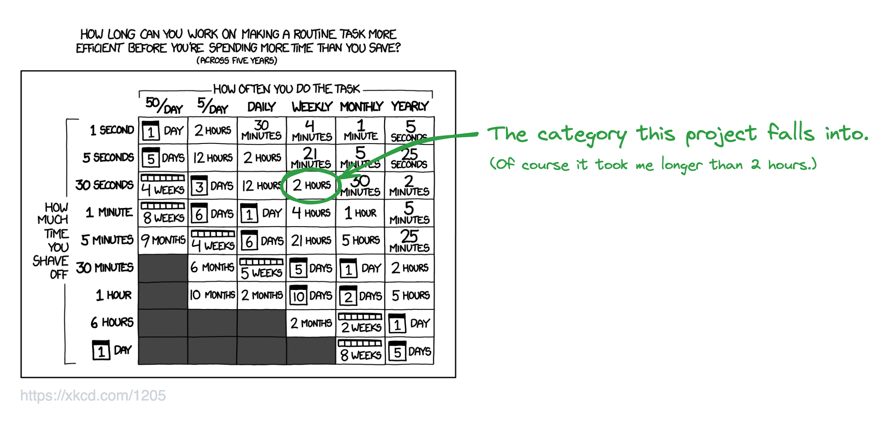

# discover-weekly-log

**Copy your Discover Weekly playlist into a separate playlist.**

The Python script in this repository appends all tracks of one playlist to another playlist in your library.

I, personally, use it to copy all songs in my _Discover Weekly_ Playlist to another playlist on a weekly schedule, so I can listen to them at a later time.

To run the script on a schedule, I dockerized it, pushed the image to AWS ECR, created a AWS Lambda function with that image and created a EventBridge rule to trigger the Lambda function once a week.

> [!NOTE]
> I used this project to learn about Docker and try out AWS Lambda. (No guarantee that this is the best or simplest way to realize it.)

If you want to try it out yourself, follow these steps:

## Create a Spotify Application

First, you need credentials to authenticate with Spotify's Web API. We will be using the [Authorization Code Flow](https://developer.spotify.com/documentation/web-api/tutorials/code-flow). To achieve that, create a Spotify application:

- Go to the [Spotify Developer Dashboard](https://developer.spotify.com/dashboard) and log in.
- Click _Create App_.
- Fill out the form.
  - Give your app a name and a description
  - Add http://localhost:3000 as the website. (Doesn't really matter what you put here)
  - **Add _http://localhost:3000_ as a redirect URI. (Important!)**
  - Check _Web API_ in the _Which API/SDKs are you planning to use?_ section
  - Click _Save_
- In your newly created app, click _Settings_.
- **Save your Client ID and Client Secret**. You'll need these soon.

## Authentication and Authorization

Next, swap out `<your_apps_client_id>` in the following URL with your app's actual Client ID. Then visit the URL with your browser, log into Spotify and authorize your application.

```
https://accounts.spotify.com/authorize?client_id=<your_apps_client_id>&response_type=code&redirect_uri=http%3A%2F%2Flocalhost:3000&scope=&scope=playlist-read-private%20playlist-modify-private%20playlist-modify-public
```

After authorizing, you'll be redirected back to your `redirect_uri`. In the URL, there's now a code query parameter. **Save this value.**

```
http://localhost:3000/?code=RiWLG...1MC40
```

Then, to retrieve the refresh token, generate a Base64 encoded string containing the Client ID and Secret, separated by a colon like this: `<client_id>:<client_secret>`. You can use the following command to do that.

```
echo -n "<client_id>:<client_secret>" | base64
```

Swap out `<base64 encoded client_id:client_secret>`and `<code>`. `<code>` is the query parameter you saved earlier.

```zsh
curl -H "Authorization: Basic <base64 encoded client_id:client_secret>" -d grant_type=authorization_code -d code=<code> -d redirect_uri=http%3A%2F%2Flocalhost:3000 https://accounts.spotify.com/api/token
```

This will return a JSON response containing a **`refresh_token`**. This token is valid indefinitely unless you revoke access. Save your refresh token.

## Add .env file

As a last step, add a file with the name `.env` to the root of this project. You can duplicate the `.env.example` file in the repo and rename it.

The file should contain the following environment variables:

```
SPOTIFY_CLIENT_ID=
SPOTIFY_CLIENT_SECRET=
SPOTIFY_REFRESH_TOKEN=
SPOTIFY_DISCOVER_WEEKLY_PLAYLIST_ID=
SPOTIFY_LOG_PLAYLIST_ID=
```

You have to set all 5 variables.

The first three variables you get by following the instructions in the two sections above.
`SPOTIFY_DISCOVER_WEEKLY_PLAYLIST_ID` is the ID of the playlist from which the tracks should be copied from.
`SPOTIFY_LOG_PLAYLIST_ID` is the ID of the playlist to which the tracks should be appended to.

> [!TIP]
> The best way to get the playlist ids is to open Spotify in your web browser, then navigate to the playlist you want and get the id from the URL.
>
> `https://open.spotify.com/playlist/<you_find_the_playlist_id_here>`

## Run the application 🚀

After you set all necessary environment variables, start the docker container with:

```zsh
docker-compose up
```

To trigger the lambda function handler use:

```zsh
curl "http://localhost:9000/2015-03-31/functions/function/invocations" -d '{}'
```

Finally, check Spotify if the tracks from the one playlist were actually appended to the other one.

## Relevant xkcd comic

<a href="https://xkcd.com/1205"></a>
